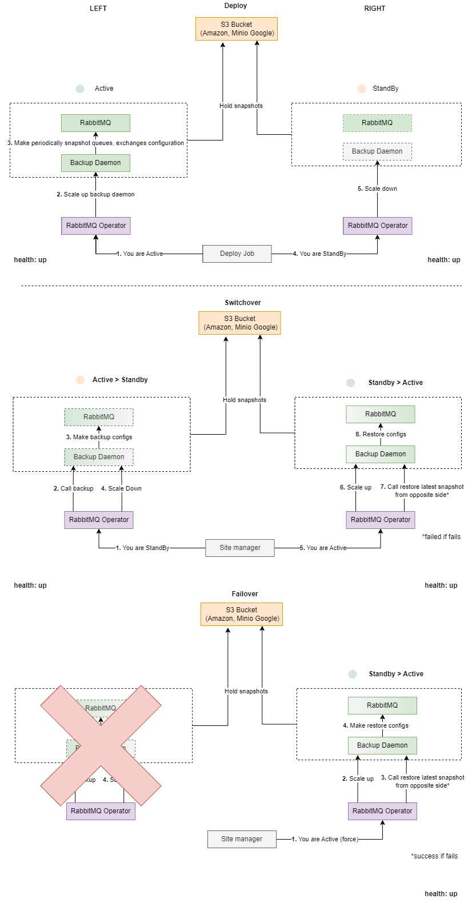

The section provides information about Disaster Recovery in RabbitMQ service.

## Common Information

The Disaster Recovery scheme implies two separate RabbitMQ clusters, one of which is in the `active` mode, and the other is in the `standby` mode.



The `active` RabbitMQ cluster has an active backup daemon. The `standby` RabbitMQ cluster has a down backup daemon. When disaster recovery mode
is switched on `standby`/`active` the RabbitMQ backup daemon is down/up. RabbitMQ backup daemon performs full backup before it will be down (switchover from `active` to `standby`).
RabbitMQ backup daemon restores last full backup from another region after it will be up (switchover from `standby` to `active`).

## Configuration

The Disaster Recovery (DR) configuration requires two separate RabbitMQ clusters installed on two Kubernetes/OpenShift clusters.
Each RabbitMQ cluster must be deployed with unique `region` and `mode` parameters. For example, for `active` side:

  ```yaml
  disasterRecovery:
    mode: "active"
    region: "north-america"
  ```

For example, for `standby` side:

  ```yaml
  disasterRecovery:
    mode: "standby"
    region: "europe"
  ```

  **Note**: `active` and `standby` RabbitMQ clusters use the same S3 storage to keep backups. To recognize a backup from another side
  `region` parameter is used. You must set different `region` for `active` and `standby` sides and never ignore this parameter in your
  installations.

## RabbitMQ Backup Daemon

The RabbitMQ backup daemon must be installed in the disaster recovery schema. Backup daemon is up on the `active` side and is down on the `standby` one.
For more information about `RabbitMQ Backup Daemon`, refer to [Backup Daemon](maintenance.md#backup-and-recovery).

In Disaster Recovery scheme the `REGION` environment variable is automatically added to the RabbitMQ backup daemon deployment.
Each backup will contain information about `REGION` as `region` custom parameter. If backup daemon tries to restore backup on `active`
side it will restore the latest backup from the `other` region. The `standby` to `active` switchover process will be failed if
there is no backup from the other region. But, the restore process will be skipped in this case without fail if `noWait` site manager parameter is `true`.

## Configuration Example

You want to install RabbitMQ service in Disaster Recovery scheme. Each RabbitMQ cluster is located in `rabbitmq` namespace. Each RabbitMQ backup daemon performs backup every 15 minutes.

The configuration for `active` RabbitMQ cluster is as follows:

```yaml
name: rabbitmq-service

disasterRecovery:
  mode: "active"
  region: "north-america"

rabbitmq:
  auto_reboot: true
  hostpath_configuration: false
  custom_params:
    rabbitmq_vm_memory_high_watermark: 80%
    rabbitmq_default_user: admin
    rabbitmq_default_password: admin
  replicas: 3
  resources:
    requests:
      cpu: 1
      memory: 2Gi
    limits:
      cpu: 1
      memory: 2Gi
    storage: 499Mi
    storageclass: teststorage
  enabledPlugins:
    - rabbitmq_shovel
    - rabbitmq_federation
backupDaemon:
  enabled: true
  backupSchedule: "*/15 * * * *"
  evictionPolicy: "1h/1d,7d/delete"
  persistentVolume: null
  s3:
    enabled: true
    url: "http://s3-storage.environment.openshift.sdntest.qubership.org"
    bucket: "rabbitmqbucket"
    keyId: "s3keyid"
    keySecret: "s3keysecret"
```

The configuration for `standby` RabbitMQ cluster is as follows:

```yaml
name: rabbitmq-service

disasterRecovery:
  mode: "standby"
  region: "europe"

rabbitmq:
  auto_reboot: true
  hostpath_configuration: false
  custom_params:
    rabbitmq_vm_memory_high_watermark: 80%
    rabbitmq_default_user: admin
    rabbitmq_default_password: admin
  replicas: 3
  resources:
    requests:
      cpu: 1
      memory: 2Gi
    limits:
      cpu: 1
      memory: 2Gi
    storage: 499Mi
    storageclass: teststorage
  enabledPlugins:
    - rabbitmq_shovel
    - rabbitmq_federation
backupDaemon:
  enabled: true
  backupSchedule: "*/15 * * * *"
  evictionPolicy: "1h/1d,7d/delete"
  persistentVolume: null
  s3:
    enabled: true
    url: "http://s3-storage.com"
    bucket: "rabbitmqbucket"
    keyId: "s3keyid"
    keySecret: "s3keysecret"
```

**Note**: Pay attention, `rabbitmq.auto_reboot` property leads to restart if some of rabbitmq parameters was changed. It is recomended to use the current `disasterRecovery.mode` during upgrade.

## Switchover

You can perform the switchover using the `SiteManager` functionality or RabbitMQ disaster recovery REST server API.

<!-- #GFCFilterMarkerStart# -->
For more information about `SiteManager`, refer to [Site Manager](https://github.com/Netcracker/qubership-core-site-management/blob/main/README.md) article.
<!-- #GFCFilterMarkerEnd# -->

If you want to perform a switchover manually, you need to switch `active` RabbitMQ cluster to `standby` mode and then switch `standby` RabbitMQ cluster to `active` mode.
You need to run the following command from within any RabbitMQ pod on the `active` side:

```sh
curl -XPOST -H "Content-Type: application/json" http://rabbitmq-disaster-recovery.<NAMESPACE>:8080/sitemanager -d '{"mode":"standby"}'
```

Then you should run the following command from within any RabbitMQ pod on the `standby` side:

```sh
curl -XPOST -H "Content-Type: application/json" http://rabbitmq-disaster-recovery.<NAMESPACE>:8080/sitemanager -d '{"mode":"active"}'
```

Where `<NAMESPACE>` is the OpenShift/Kubernetes project/namespace of the RabbitMQ cluster side. For example, `rabbitmq-service`.

**NOTE:** If TLS for Disaster Recovery is enabled (`global.tls.enabled` and `disasterRecovery.tls.enabled` parameters are set to `true`),
use `https` protocol and `8443` port in API requests rather than `http` protocol and `8080` port.

For more information about RabbitMQ disaster recovery REST server API, see [REST API](#rest-api).

## REST API

RabbitMQ disaster recovery REST server provides three methods of interaction:

* `GET` `healthz` method allows finding out the state of the current RabbitMQ cluster side.
  If the current RabbitMQ cluster side is `standby` or `disable`, only RabbitMQ stateful set state is checked.
  If the current RabbitMQ cluster side is `active`, the RabbitMQ backup daemon state is checked additionally. You can run this method from within any RabbitMQ pod as follows:

  ```sh
  curl -XGET http://rabbitmq-disaster-recovery.<NAMESPACE>:8080/healthz
  ```

  Where `<NAMESPACE>` is the OpenShift/Kubernetes project/namespace of the RabbitMQ cluster side. For example, `rabbitmq-service`.

  All RabbitMQ disaster recovery REST server endpoints can be secured via Kubernetes JWT Service Account Tokens.
  To enable disaster recovery REST server authentication the `disasterRecovery.httpAuth.enabled` deployment parameter must be `true`.
  The example for secured `healthz` endpoint is following:

  ```sh
  curl -XGET -H "Authorization: Bearer <TOKEN>" http://rabbitmq-disaster-recovery.<NAMESPACE>:8080/healthz
  ```

  Where `TOKEN` is Site Manager Kubernetes JWT Service Account Token.
  The verification service account name and namespace are specified in `disasterRecovery.httpAuth.smServiceAccountName` and `disasterRecovery.httpAuth.smNamespace` deploy parameters.

  The response to such a request is as follows:

  ```json
  {"status":"up"}
  ```

  Where:
  * `status` is the current state of the RabbitMQ cluster side. The four possible status values are as follows:
    * `up` - Both RabbitMQ stateful set and RabbitMQ backup daemon deployment are ready.
    * `degraded` - Some of RabbitMQ pods are not ready or RabbitMQ backup daemon deployment is not ready.
    * `down` - RabbitMQ stateful set is not ready.
    * `disable` - The RabbitMQ service is switched off.

* `GET` `sitemanager` method allows finding out the mode of the current RabbitMQ cluster side and the actual state of the switchover procedure. You can run this method from within any RabbitMQ pod as follows:

  ```sh
  curl -XGET http://rabbitmq-disaster-recovery.<NAMESPACE>:8080/sitemanager
  ```

  Where `<NAMESPACE>` is the OpenShift/Kubernetes project/namespace of the RabbitMQ cluster side. For example, `rabbitmq-service`.

  All RabbitMQ disaster recovery REST server endpoints can be secured via Kubernetes JWT Service Account Tokens.
  To enable disaster recovery REST server authentication the `disasterRecovery.httpAuth.enabled` deployment parameter must be `true`.
  The example for secured `sitemanager` GET endpoint is following:

  ```sh
  curl -XGET -H "Authorization: Bearer <TOKEN>" http://rabbitmq-disaster-recovery.<NAMESPACE>:8080/sitemanager
  ```

  Where `TOKEN` is Site Manager Kubernetes JWT Service Account Token.
  The verification service account name and namespace are specified in `disasterRecovery.httpAuth.smServiceAccountName` and `disasterRecovery.httpAuth.smNamespace` deploy parameters.

  The response to such a request is as follows:

  ```json
  {"mode":"standby","status":"done"}
  ```

  Where:
  * `mode` is the mode in which the RabbitMQ cluster side is deployed. The possible mode values are as follows:
    * `active` - RabbitMQ accepts external requests from clients and RabbitMQ backup daemon is up.
    * `standby` - RabbitMQ does not accept external requests from clients.
    * `disable` - RabbitMQ does not accept external requests from clients and RabbitMQ backup daemon is down.
  * `status` is the current state of switchover for the RabbitMQ cluster side. The three possible status values are as follows:
    * `running` - The switchover is in progress.
    * `done` - The switchover is successful.
    * `failed` - Something went wrong during the switchover.
  * `message` is the message which contains a detailed description of the problem.

* `POST` `sitemanager` method allows switching mode for the current side of RabbitMQ cluster. You can run this method from within any RabbitMQ pod as follows:

  ```sh
  curl -XPOST -H "Content-Type: application/json" http://rabbitmq-disaster-recovery.<NAMESPACE>:8080/sitemanager -d '{"mode":"<MODE>"}'
  ```

  Where:
  * `<NAMESPACE>` is the OpenShift/Kubernetes project/namespace of the RabbitMQ cluster side. For example, `rabbitmq-service`.
  * `<MODE>` is the mode to be applied to the RabbitMQ cluster side. The possible mode values are as follows:
    * `active` - RabbitMQ accepts external requests from clients and RabbitMQ backup daemon is up.
    * `standby` - RabbitMQ does not accept external requests from clients.
    * `disable` - RabbitMQ does not accept external requests from clients and RabbitMQ backup daemon is down.

  All RabbitMQ disaster recovery REST server endpoints can be secured via Kubernetes JWT Service Account Tokens.
* To enable disaster recovery REST server authentication the `disasterRecovery.httpAuth.enabled` deployment parameter must be `true`.
  The example for secured `sitemanager` POST endpoint is following:

  ```sh
  curl -XPOST -H "Content-Type: application/json, Authorization: Bearer <TOKEN>" http://rabbitmq-disaster-recovery.<NAMESPACE>:8080/sitemanager
  ```

  Where `TOKEN` is Site Manager Kubernetes JWT Service Account Token.
* The verification service account name and namespace are specified in `disasterRecovery.httpAuth.smServiceAccountName` and `disasterRecovery.httpAuth.smNamespace` deploy parameters.

  The response to such a request is as follows:

  ```json
  {"mode":"standby"}
  ```

  Where:
  * `mode` is the mode which is applied to the RabbitMQ cluster side. The possible values are `active`, `standby` and `disable`.
  * `status` is the state of the request on the REST server. The only possible value is `failed`, when something goes wrong while processing the request.
  * `message` is the message which contains a detailed description of the problem.
  
**NOTE:** If TLS for Disaster Recovery is enabled (`global.tls.enabled` and `disasterRecovery.tls.enabled` parameters are set to `true`),
use `https` protocol and `8443` port in API requests rather than `http` protocol and `8080` port.

## Troubleshooting

If switchover or any other DR operation failed you can try to execute it again for this service only.
The DR feature supports retry if operation has not been finished successfully.
You can do it with SiteManager Client or [REST API](#rest-api) described above.
You need to execute it in the sequence `active -> standby` first, `standby -> active` then.
To skip replication validation you can add `"no-wait": true` parameter to `/sitemanager` request's body.

If the automatic switchover operation for active side failed you can also try to perform it manually:

1. Open terminal for `rabbitmq-backup-daemon` pod (scale up it if necessary).
2. Get the list of available backups (vaultIds) using Backup Daemon REST API. For example, `curl -u admin:admin -XGET localhost:8080/listbackups`.
3. Find the latest full backup (`"db_list": full backup"`) from another region (`custom_vars.region`). For example, `curl -u admin:admin -XGET localhost:8080/listbackups/20210913T1114`.
4. Try to restore it. For example, `curl -XPOST -u username:password -v -H "Content-Type: application/json" -d  '{"vault":"20210913T1114"}' localhost:8080/restore`.
5. Check restore job using id you got on previous step status to make sure it finished successfully.  For example, `curl -u admin:admin -XGET localhost:8080/listbackups/fcds677s826-18s73ds5-smof788`.
