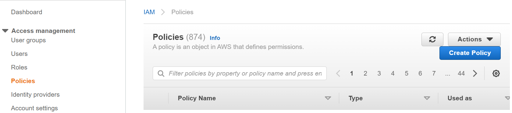
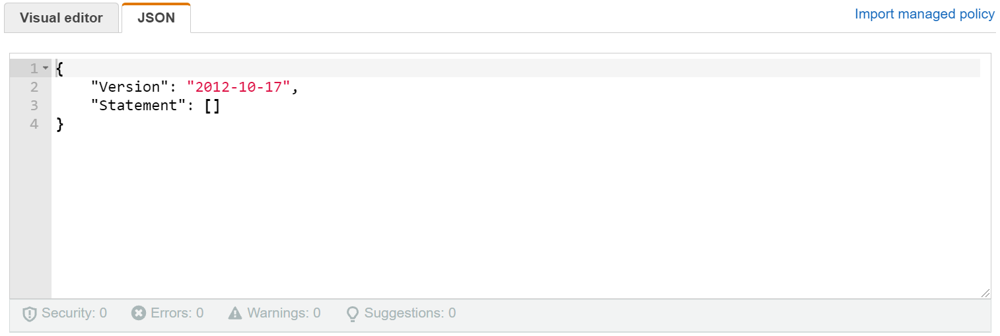
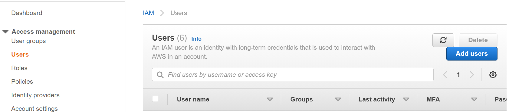
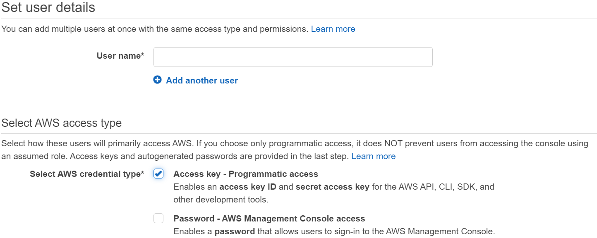
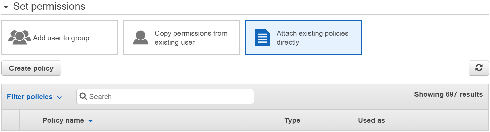
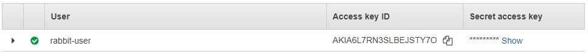
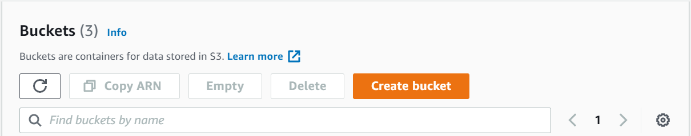
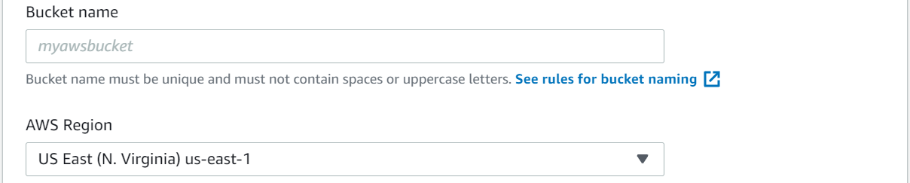

- [Introduction](#introduction)
- [Prerequisites](#prerequisites)
    - [Global](#global)
    - [Preparations for Backup](#preparations-for-backup)
- [Example of Deploy Parameters](#example-of-deploy-parameters)

# Introduction

RabbitMQ Service chart allows you to deploy RabbitMQ side services (Monitoring and Backup Daemon) without deploying RabbitMQ, using AmazonMQ with RabbitMQ cluster.

# Prerequisites

## Global

* External AmazonMQ URL is available from Kubernetes cluster where you are going to deploy side services.
* AmazonMQ user credentials are provided. User has admin rights.
* There is local Helm configured to deploy to necessary Kubernetes cluster.

## Preparations for Backup

To store backups to Amazon S3 storage you need to perform the following steps before deploy:

1. Create policy in AWS Console:

    * Navigate to IAM dashboard in AWS Console.
    * Choose **Policies** in the navigation pane on the left and press the **Create Policy** button.
      
    * Choose the **JSON** tab.
      
    * Paste the following policy document:

      ```yaml
        {
          "Version": "2012-10-17",
          "Statement": [
            {
              "Sid": "VisualEditor0",
              "Effect": "Allow",
              "Action": "s3:*",
              "Resource": [
                  "arn:aws:s3:::rabbit-backups",
                  "arn:aws:s3:::rabbit-backups/*"
              ]
            }
          ]
        }
      ```

      For details about the IAM policy language, see [IAM JSON policy reference](https://docs.aws.amazon.com/IAM/latest/UserGuide/reference_policies.html).
    * When you are finished, press the **Next: Tags** button and then the **Next: Review** button.
    * On the **Review policy** page, type a **Name** and a **Description** (optional) for the policy that you are creating.
    * Press the **Create policy** button to save your work.

   More information about IAM policy creation in [Creating IAM policies (console)](https://docs.aws.amazon.com/IAM/latest/UserGuide/access_policies_create-console.html).

2. Create user in AWS Console:

   * Navigate to IAM dashboard in AWS Console.
   * Choose **Users** in the navigation pane on the left and press the **Add users** button.
     
   * Type the **User name** for the new user and select **Programmatic access** checkbox.
     
   * Press the **Next: Permissions** button.
   * On the **Set permissions** page, choose the **Attach existing policies directly** option.
     
   * Select the policy that you created before.
   * Press the **Next: Tags** button and then the **Next: Review** button.
   * When you are reviewed, press the **Create user** button to save your work.
     
   * Store the user access keys (access key IDs and secret access keys).

   More information about IAM user creation in [Creating an IAM user in your AWS account](https://docs.aws.amazon.com/IAM/latest/UserGuide/id_users_create.html).

3. Create bucket of S3 storage in AWS Console:

    * Navigate to your S3 storage in AWS Console.
    * Press the **Create bucket** button.
      
    * Type the **Bucket name** and choose the **AWS Region** where you want the bucket to be located.
      
    * When you are finished, press the **Create bucket** button to save your work.

   More information about S3 bucket creation in [Creating a bucket](https://docs.aws.amazon.com/AmazonS3/latest/userguide/create-bucket-overview.html).

# Example of Deploy Parameters

Example of deployment parameters for AmazonMQ is presented below:

```yaml
externalRabbitmq:
  enabled: true
  url: https://vpc-amazon.mq.us-east-1.amazonaws.com
  username: admin
  password: admin
  replicas: 1
  clusterName: test-rabbitmq-01
telegraf:
  install: true
  metricCollectionInterval: 30s
backupDaemon:
  enabled: true
  s3:
    enabled: true
    url: https://s3.amazonaws.com
    bucket: rabbitmq-backup
    keyId: AKIA8Z7RN3SLODHHKA7Y
    keySecret: ZaROE3F0SvLT7jnSxbJ8XNh+fG0sZ8ze9aou3t6v
rabbitmqPrometheusMonitoring: false
```

**NOTE:** This is an example, do not copy it as-is for your deployment, be sure about each parameter in your installation.
