[[_TOC_]]

# RabbitMQ Monitoring

This section describes the metrics available for monitoring RabbitMQ Cluster dashboards.

## RabbitMQ Overview Dashboard

`RabbitMQ-Overview Dashboard` includes the `KUBERNETES METRICS OVERVIEW` section and the sections from [Community RabbitMQ Dashboard](https://www.rabbitmq.com/prometheus.html).
To view the metrics for a specified project, from the `RabbitMQ Cluster` list, select the required project.
For example, for a namespace with the name `customernamespace`, the RabbitMQ Cluster variable is `rabbit@rmqlocal-0.rmqlocal.customernamespace.svc.cluster.local`.
The sections from community RabbitMQ dashboard include all metrics displayed on RabbitMQ Management Overview page.
The panels in the community RabbitMQ dashboard include explanation for all metrics displayed, with links to relevant official documents and guides.

**Note**: Currently due to [https://github.com/rabbitmq/rabbitmq-prometheus/issues/30](https://github.com/rabbitmq/rabbitmq-prometheus/issues/30),
`Publishers` metric on Grafana dashboard does not work.

### Kubernetes Metrics Overview

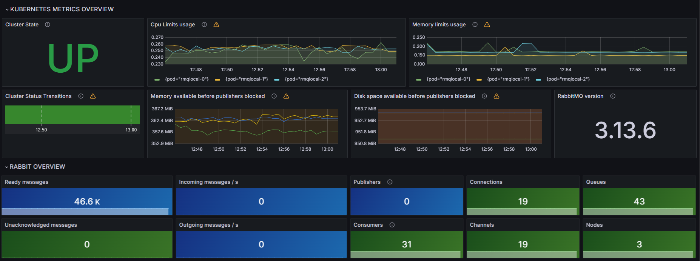

* `Cluster state` - Displays the state of cluster. The following cluster states are displayed:
  * `UP` - All nodes are running.
  * `DOWN` - All nodes are down.
  * `DEGRADED` - Some nodes are not running.

* `Cpu Limits usage` - Displays the ratio of pod CPU used to pod CPU limits.

* `Memory limits usage` - Displays the ratio of pod CPU used to pod CPU limits.

* `Cluster Status Transitions` - Displays the transitions of RabbitMQ cluster statuses.

* `Memory available before publishers blocked` - Displays the memory available before publishers blocked.
  If the value is zero or less, the memory alarm will be triggered and all publishing connections across all cluster nodes will be blocked.
  This value can temporarily go negative because the memory alarm is triggered with a slight delay.
  The kernel's view of the amount of memory used by the node can differ from what the node itself can observe. This means that this value can be negative for a sustained period of time.
  By default, nodes use resident set size (RSS) to compute how much memory they use. This strategy can be changed (see the guides below).

   * [Alarms](https://www.rabbitmq.com/alarms.html)
   * [Memory Alarms](https://www.rabbitmq.com/memory.html)
   * [Reasoning About Memory Use](https://www.rabbitmq.com/memory-use.html)
   * [Blocked Connection Notifications](https://www.rabbitmq.com/connection-blocked.html)

* `Disk space available before publishers blocked` - Displays the disk space available before publishers blocked.
  This metric is reported for the partition where the RabbitMQ data directory is stored.
  If the value is zero or less, the disk alarm will be triggered and all publishing connections across all cluster nodes will be blocked.
  This value can temporarily go negative because the free disk space alarm is triggered with a slight delay.

    * [Alarms](https://www.rabbitmq.com/alarms.html)
    * [Disk Space Alarms](https://www.rabbitmq.com/disk-alarms.html)
    * [Disk Space](https://www.rabbitmq.com/production-checklist.html#resource-limits-disk-space)
    * [Persistence Configuration](https://www.rabbitmq.com/persistence-conf.html)
    * [Blocked Connection Notifications](https://www.rabbitmq.com/connection-blocked.html)

* `RabbitMQ Version` - Displays the RabbitMQ Version.

### Rabbit Overview

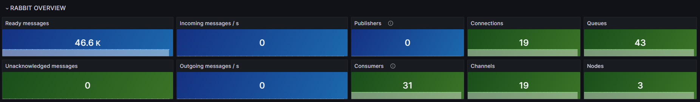

* `Ready messages`
* `Incoming messages / s`
* `Publishers`
* `Connections`
* `Queues`
* `Unacknowledged messages`
* `Outgoing messages / s`
* `Consumers`
* `Channels`
* `Nodes`

### Nodes

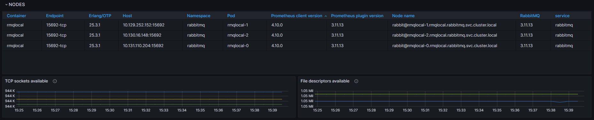

* Table with the following information about containers :
  * `Container`
  * `Endpoint`
  * `Erlang/OTP`
  * `Host`
  * `Namespace`
  * `Pod`
  * `Prometheus clients version`
  * `Prometheus plugin version`
  * `Node name`
  * `RabbitMQ`
  * `Service`

* `TCP sockets available` - When this value reaches zero, new connections will not be accepted.
  Client libraries, peer nodes and CLI tools will not be able to connect when the node runs out of available file descriptors.
  [Networking and RabbitMQ](https://www.rabbitmq.com/networking.html)

* `File descriptors available` When this value reaches zero, new connections will not be accepted and disk write operations may fail.
  Client libraries, peer nodes and CLI tools will not be able to connect when the node runs out of available file descriptors.
  [Open File Handles Limit](https://www.rabbitmq.com/production-checklist.html#resource-limits-file-handle-limit)

### Queued Messages

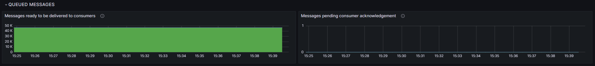

* `Messages ready to be delivered to consumers` - Total number of ready messages ready to be delivered to consumers.
  Aim to keep this value as low as possible. RabbitMQ behaves best when messages are flowing through it. It's OK for publishers to occasionally outpace consumers,
  but the expectation is that consumers will eventually process all ready messages.
  If this metric keeps increasing, your system will eventually run out of memory and/or disk space. Consider using TTL or Queue Length Limit to prevent unbounded message growth.
  * [Queues](https://www.rabbitmq.com/queues.html)
  * [Consumers](https://www.rabbitmq.com/consumers.html)
  * [Queue Length Limit](https://www.rabbitmq.com/maxlength.html)
  * [Time-To-Live and Expiration](https://www.rabbitmq.com/ttl.html)

* `Messages pending consumer acknowledgement` - The total number of messages that are either in-flight to consumers, currently being processed by consumers or simply waiting for the consumer
  acknowledgements to be processed by the queue. Until the queue processes the message acknowledgement, the message will remain unacknowledged.
  * [Queues](https://www.rabbitmq.com/queues.html)
  * [Confirms and Acknowledgements](https://www.rabbitmq.com/confirms.html)
  * [Consumer Prefetch](https://www.rabbitmq.com/consumer-prefetch.html)

### Incoming Messages

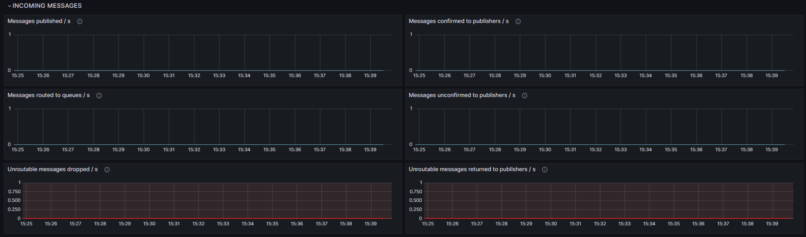

* `Messages published / s` - The incoming message rate before any routing rules are applied.
  If this value is lower than the number of messages published to queues, it may indicate that some messages are delivered to more than one queue.
  If this value is higher than the number of messages published to queues, messages cannot be routed and will either be dropped or returned to publishers.
  * [Publishers](https://www.rabbitmq.com/publishers.html)

* `Messages confirmed to publishers / s` - The rate of messages confirmed by the broker to publishers. Publishers must opt-in to receive message confirmations.
  If this metric is consistently at zero it may suggest that publisher confirms are not used by clients. The safety of published messages is likely to be at risk.
  * [Publisher Confirms](https://www.rabbitmq.com/confirms.html#publisher-confirms)
  * [Publisher Confirms and Data Safety](https://www.rabbitmq.com/publishers.html#data-safety)
  * [When Will Published Messages Be Confirmed by the Broker?](https://www.rabbitmq.com/confirms.html#when-publishes-are-confirmed)

* `Messages routed to queues / s` - The rate of messages received from publishers and successfully routed to the master queue replicas.
  * [Queues](https://www.rabbitmq.com/queues.html)
  * [Publishers](https://www.rabbitmq.com/publishers.html)

* `Messages unconfirmed to publishers / s` - The rate of messages received from publishers that have publisher confirms enabled and the broker has not confirmed yet.
  * [Publishers](https://www.rabbitmq.com/publishers.html)
  * [Confirms and Acknowledgements](https://www.rabbitmq.com/confirms.html)
  * [When Will Published Messages Be Confirmed by the Broker?](https://www.rabbitmq.com/confirms.html#when-publishes-are-confirmed)

* `Unroutable messages dropped / s` - The rate of messages that cannot be routed and are dropped.
  Any value above zero means message loss and likely suggests a routing problem on the publisher end.
  * [Unroutable Message Handling](https://www.rabbitmq.com/publishers.html#unroutable)

* `Unroutable messages returned to publishers / s` - The rate of messages that cannot be routed and are returned back to publishers.
  Sustained values above zero may indicate a routing problem on the publisher end.
  * [Unroutable Message Handling](https://www.rabbitmq.com/publishers.html#unroutable)
  * [When Will Published Messages Be Confirmed by the Broker?](https://www.rabbitmq.com/confirms.html#when-publishes-are-confirmed)

### Outgoing Messages

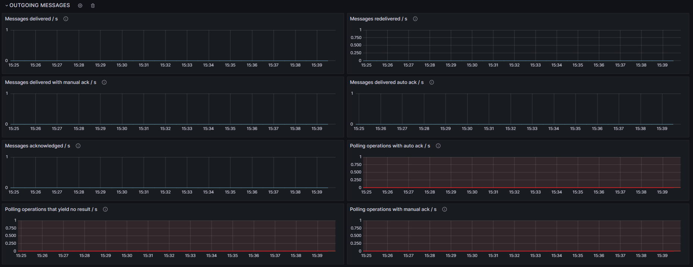

* `Messages delivered / s` - The rate of messages delivered to consumers. It includes messages that have been redelivered.
  This metric does not include messages that have been fetched by consumers using `basic.get` (consumed by polling).
  * [Consumers](https://www.rabbitmq.com/consumers.html)

* `Messages redelivered / s` - The rate of messages that have been redelivered to consumers.
  It includes messages that have been requeued automatically and redelivered due to channel exceptions or connection closures.
  Having some redeliveries is expected, but if this metric is consistently non-zero, it is worth investigating why.
  * [Negative Acknowledgement and Requeuing of Deliveries](https://www.rabbitmq.com/confirms.html#consumer-nacks-requeue)
  * [Consumers](https://www.rabbitmq.com/consumers.html)

* `Messages delivered with manual ack / s` - The rate of message deliveries to consumers that use manual acknowledgement mode.
  When this mode is used, RabbitMQ waits for consumers to acknowledge messages before more messages can be delivered.
  This is the safest way of consuming messages.
  * [Consumer Acknowledgements](https://www.rabbitmq.com/confirms.html)
  * [Consumer Prefetch](https://www.rabbitmq.com/consumer-prefetch.html)
  * [Consumer Acknowledgement Modes, Prefetch and Throughput](https://www.rabbitmq.com/confirms.html#channel-qos-prefetch-throughput)
  * [Consumers](https://www.rabbitmq.com/consumers.html)

* `Messages delivered auto ack / s` - The rate of message deliveries to consumers that use automatic acknowledgement mode.
  When this mode is used, RabbitMQ does not wait for consumers to acknowledge message deliveries.
  This mode is fire-and-forget and does not offer any delivery safety guarantees. It tends to provide higher throughput and it may lead to consumer overload and higher consumer memory usage.
  * [Consumer Acknowledgement Modes, Prefetch and Throughput](https://www.rabbitmq.com/confirms.html#channel-qos-prefetch-throughput)
  * [Consumers](https://www.rabbitmq.com/consumers.html)

* `Messages acknowledged / s` - The rate of message acknowledgements coming from consumers that use manual acknowledgement mode.
  * [Consumer Acknowledgements](https://www.rabbitmq.com/confirms.html)
  * [Consumer Prefetch](https://www.rabbitmq.com/consumer-prefetch.html)
  * [Consumer Acknowledgement Modes, Prefetch and Throughput](https://www.rabbitmq.com/confirms.html#channel-qos-prefetch-throughput)
  * [Consumers](https://www.rabbitmq.com/consumers.html)

* `Polling operations with auto ack / s` - The rate of messages delivered to polling consumers that use automatic acknowledgement mode.
  The use of polling consumers is highly inefficient and therefore strongly discouraged.
  * [Fetching individual messages](https://www.rabbitmq.com/consumers.html#fetching)
  * [Consumers](https://www.rabbitmq.com/consumers.html)

* `Polling operations that yield no result / s` - The rate of polling consumer operations that yield no result.
  Any value above zero means that RabbitMQ resources are wasted by polling consumers.
  Compare this metric to the other polling consumer metrics to see the inefficiency rate.
  The use of polling consumers is highly inefficient and therefore strongly discouraged.
  * [Fetching individual messages](https://www.rabbitmq.com/consumers.html#fetching)
  * [Consumers](https://www.rabbitmq.com/consumers.html)

* `Polling operations with manual ack / s` - The rate of messages delivered to polling consumers that use manual acknowledgement mode.
  The use of polling consumers is highly inefficient and therefore strongly discouraged.
  * [Fetching individual messages](https://www.rabbitmq.com/consumers.html#fetching)
  * [Consumers](https://www.rabbitmq.com/consumers.html)

### Queues

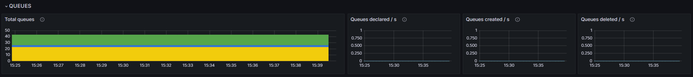

* `Total queues` - Total number of queue masters  per node.
  This metric makes it easy to see sub-optimal queue distribution in a cluster.
  * [Queue Masters, Data Locality](https://www.rabbitmq.com/ha.html#master-migration-data-locality)
  * [Queues](https://www.rabbitmq.com/queues.html)

* `Queues declared / s` - The rate of queue declarations performed by clients.
  Low sustained values above zero are to be expected. High rates may be indicative of queue churn or high rates of connection recovery.
  Confirm connection recovery rates by using the _Connections opened_ metric.
  * [Queues](https://www.rabbitmq.com/queues.html)

* `Queues created / s` - The rate of new queues created (as opposed to redeclarations).
  Low sustained values above zero are to be expected. High rates may be indicative of queue churn or high rates of connection recovery.
  Confirm connection recovery rates by using the _Connections opened_ metric.
  * [Queues](https://www.rabbitmq.com/queues.html)

* `Queues deleted / s` - The rate of queues deleted.
  Low sustained values above zero are to be expected. High rates may be indicative of queue churn or high rates of connection recovery.
  Confirm connection recovery rates by using the _Connections opened_ metric.
  * [Queues](https://www.rabbitmq.com/queues.html)

### Channels

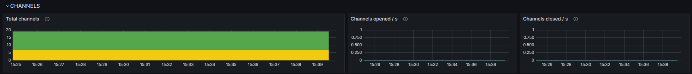

* `Total channels` - Total number of channels on all currently opened connections.
  If this metric grows monotonically it is highly likely a channel leak in one of the applications. Confirm channel leaks by using the _Channels opened_ and _Channels closed_ metrics.
  * [Channel Leak](https://www.rabbitmq.com/channels.html#channel-leaks)
  * [Channels](https://www.rabbitmq.com/channels.html)

* `Channels opened / s` - The rate of new channels opened by applications across all connections. Channels are expected to be long-lived.
  Low sustained values above zero are to be expected. High rates may be indicative of channel churn or mass connection recovery.
  Confirm connection recovery rates by using the _Connections opened_ metric.
  * [High Channel Churn](https://www.rabbitmq.com/channels.html#high-channel-churn)
  * [Channels](https://www.rabbitmq.com/channels.html)

* `Channels closed / s` - The rate of channels closed by applications across all connections. Channels are expected to be long-lived.
  Low sustained values above zero are to be expected. High rates may be indicative of channel churn or mass connection recovery.
  Confirm connection recovery rates by using the _Connections opened_ metric.
  * [High Channel Churn](https://www.rabbitmq.com/channels.html#high-channel-churn)
  * [Channels](https://www.rabbitmq.com/channels.html)

### Connections

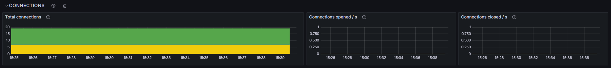

* `Total connections` - Total number of client connections.
  If this metric grows monotonically it is highly likely a connection leak in one of the applications.
  Confirm connection leaks by using the _Connections opened_ and _Connections closed_ metrics.
  * [Connection Leak](https://www.rabbitmq.com/connections.html#monitoring)
  * [Connections](https://www.rabbitmq.com/connections.html)

* `Connections opened / s` - The rate of new connections opened by clients. Connections are expected to be long-lived.
  Low sustained values above zero are to be expected. High rates may be indicative of connection churn or mass connection recovery.
  * [Connection Leak](https://www.rabbitmq.com/connections.html#monitoring)
  * [Connections](https://www.rabbitmq.com/connections.html)

* `Connections closed / s` - The rate of new connections opened by clients. Connections are expected to be long-lived.
  Low sustained values above zero are to be expected. High rates may be indicative of connection churn or mass connection recovery.
  * [Connection Leak](https://www.rabbitmq.com/connections.html#monitoring)
  * [Connections](https://www.rabbitmq.com/connections.html)

## Erlang Distribution Dashboard

The RabbitMQ deployment also includes community Erlang Distribution dashboard. This Dashboard shows metrics for inter-node communication.
For more information, refer to the [Official RabbitMQ Documentation](https://www.rabbitmq.com/clustering.html#cluster-membership).

## RabbitMQ Queues Dashboard

If your RabbitMQ base version is 3.8.4 or above, the per queue metrics needed for RabbitMQ queues dashboard is disabled by default. However, it is possible to enable the per queue metrics if needed.
**WARNING: This can drastically increase the resource usage**.
To enable the metrics for RabbitMQ queue, set the `rabbitmq.perQueueMetrics` parameter value during installation to `true`.
This adds a separate service monitor for `/metrics/per-object` RabbitMQ endpoint.
For more information refer to [https://github.com/rabbitmq/rabbitmq-server/tree/master/deps/rabbitmq_prometheus#configuration](https://github.com/rabbitmq/rabbitmq-server/tree/master/deps/rabbitmq_prometheus#configuration).

RabbitMQ queues dashboard includes metrics that RabbitMQ gathers per queue. For this dashboard, from the `RabbitMQ Cluster` list, select the required project.
For example, for a namespace with the name `customernamespace`, the RabbitMQ Cluster variable is `rabbit@rmqlocal-0.rmqlocal.customernamespace.svc.cluster.local`.
In addition, specify the host name and queue name in the `Vhost Name` and `Queue Name` fields. These variables support regular expressions, however `\` need to be escaped with another `\`.
For example `\\w+`.

### List of all queues

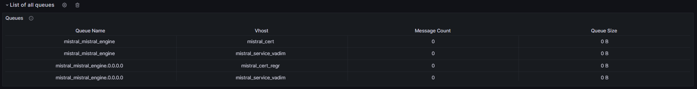

* `Queues` - table with main information about queues:
  * `Queue name` - Specific queue name.
  * `Vhost` - The virtual host.
  * `Message Count` - The number of messages in a specific queue
  * `Queue Size` - Size in bytes for a specific queue.

### Queue Messages Numbers

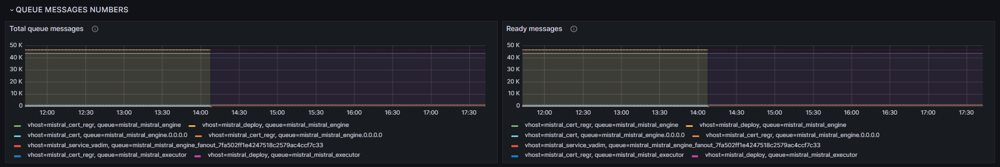

* `Total queue messages` - Displays the sum of ready and unacknowledged messages - total queue depth.

* `Ready messages` - Displays the number of messages ready to be delivered to consumers.

* `Unacknowledged messages per queue` - Displays the number of messages delivered to consumers but not yet acknowledged.

* `Persistent messages` - Displays the number of persistent messages.

* `Messages stored in memory` - Displays the number of ready and unacknowledged messages stored in memory.

* `Ready messages stored in memory` - Displays the number of ready messages stored in memory.

* `Unacknowledged messages stored in memory` - Displays the number of unacknowledged messages stored in memory.

* `Messages paged out to disk` - Displays the number of messages paged out to disk.

### Queue Messages Memory

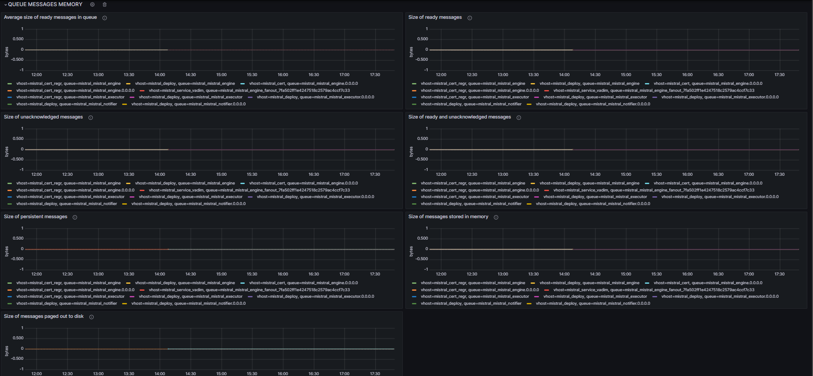

* `Average size of ready messages in queue` - Displays the average size of ready messages. This is calculated as the size of ready messages in queue in bytes divided by the number of messages.

* `Size of ready messages` - Displays the size in bytes of ready messages.

* `Size of unacknowledged messages` - Displays the size in bytes of all unacknowledged messages.

* `Size of ready and unacknowledged messages` - Displays the size in bytes of ready and unacknowledged messages.

* `Size of persistent messages` - Displays the size in bytes of persistent messages.

* `Size of messages stored in memory` - Displays the size of ready and unacknowledged messages stored in memory.

* `Size of messages paged out to disk` - Displays the size in bytes of messages paged out to disk.

### Other Queue Metrics

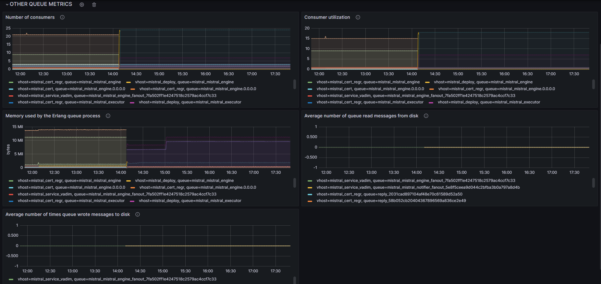

* `Number of consumers` - Displays the number of consumers for a queue.

* `Consumer utilization` - Displays the proportion of time that a queue's consumers could take new messages.

* `Memory used by the Erlang queue process` - Displays the memory in bytes used by the Erlang queue process.

* `Average number of queue read messages from disk` - Displays per second average number of queue read messages from disk in 5 minutes.

* `Average number of times queue wrote messages to disk` - Displays per second average number of times queue wrote messages to disk in 5 minutes.

## Table of Metrics

| Metric name                                                    | Description                                                                                                                                                                                  | Amazon        | Netcracker RabbitMQ Service |
|----------------------------------------------------------------|----------------------------------------------------------------------------------------------------------------------------------------------------------------------------------------------|---------------|-----------------------------|
| kube_pod_info                                                  | Information about pod                                                                                                                                                                        | Not supported | Supported                   |
| container_cpu_usage_seconds_total                              | The amount of CPU (in seconds) used by container                                                                                                                                             | Not supported | Supported                   |
| container_spec_cpu_quota                                       | The amount of CPU quota of the container                                                                                                                                                     | Not supported | Supported                   |
| container_memory_working_set_bytes                             | The amount of working set memory (in bytes), that includes recently accessed memory, dirty memory, and kernel memory                                                                         | Not supported | Supported                   |
| container_spec_memory_limit_bytes                              | The amount of memory (in bytes) that the container is limited to                                                                                                                             | Not supported | Supported                   |
| prometheus_rabbitmq_cluster_state                              | Determinate is the cluster UP or DOWN                                                                                                                                                        | Supported     | Not supported               |
| prometheus_rabbitmq_build_info                                 | RabbitMQ version info                                                                                                                                                                        | Supported     | supported                   |
| prometheus_rabbitmq_queues                                     | Queues available                                                                                                                                                                             | Supported     | Not supported               |
| prometheus_rabbitmq_queue_messages_ready                       | Messages ready to be delivered to consumers                                                                                                                                                  | Supported     | Not supported               |
| prometheus_rabbitmq_queue_messages_unacked                     | Messages delivered to consumers but not yet acknowledged                                                                                                                                     | Supported     | Not supported               |
| prometheus_rabbitmq_channel_messages_published_total           | Total number of messages published into an exchange on a channel                                                                                                                             | Supported     | Not supported               |
| prometheus_rabbitmq_channels                                   | Channels currently open                                                                                                                                                                      | Supported     | Not supported               |
| prometheus_rabbitmq_channel_consumers                          | Consumers on a channel                                                                                                                                                                       | Supported     | Not supported               |
| prometheus_rabbitmq_channel_messages_redelivered_total         | Total number of messages redelivered to consumers                                                                                                                                            | Supported     | Not supported               |
| prometheus_rabbitmq_connections                                | Connections currently open                                                                                                                                                                   | Supported     | Not supported               |
| prometheus_rabbitmq_node_count                                 | Nodes count                                                                                                                                                                                  | Supported     | Not supported               |
| prometheus_rabbitmq_process_resident_memory_bytes              | Memory used in bytes                                                                                                                                                                         | Supported     | Not supported               |
| prometheus_rabbitmq_resident_memory_limit_bytes                | Memory high watermark in bytes                                                                                                                                                               | Supported     | Not supported               |
| prometheus_rabbitmq_disk_space_available_bytes                 | Disk space available in bytes                                                                                                                                                                | Supported     | Not supported               |
| prometheus_rabbitmq_process_max_fds                            | Open file descriptors limit                                                                                                                                                                  | Supported     | Not supported               |
| prometheus_rabbitmq_process_open_fds                           | Open file descriptors                                                                                                                                                                        | Supported     | Not supported               |
| prometheus_rabbitmq_channel_messages_confirmed_total           | Total number of messages published into an exchange and confirmed on the channel                                                                                                             | Supported     | Not supported               |
| prometheus_rabbitmq_queue_messages_published_total             | Total number of messages published to queues                                                                                                                                                 | Supported     | Not supported               |
| prometheus_rabbitmq_channel_messages_unconfirmed               | Published but not yet confirmed messages                                                                                                                                                     | Supported     | Not supported               |
| prometheus_rabbitmq_channel_messages_unroutable_dropped_total  | Total number of messages published as non-mandatory into an exchange and dropped as unroutable                                                                                               | Supported     | Not supported               |
| prometheus_rabbitmq_channel_messages_unroutable_returned_total | Total number of messages published as mandatory into an exchange and returned to the publisher as unroutable                                                                                 | Supported     | Not supported               |
| prometheus_rabbitmq_channel_messages_delivered_total           | Total number of messages delivered to consumers in automatic acknowledgement mode                                                                                                            | Supported     | Not supported               |
| prometheus_rabbitmq_channel_messages_delivered_ack_total       | Total number of messages delivered to consumers in manual acknowledgement mode                                                                                                               | Supported     | Not supported               |
| prometheus_rabbitmq_channel_messages_acked_total               | Total number of messages acknowledged by consumers                                                                                                                                           | Supported     | Not supported               |
| prometheus_rabbitmq_channel_get_total                          | Total number of messages fetched with basic.get in automatic acknowledgement mode                                                                                                            | Supported     | Not supported               |
| prometheus_rabbitmq_channel_get_empty_total                    | Total number of times basic.get operations fetched no message                                                                                                                                | Supported     | Not supported               |
| prometheus_rabbitmq_channel_get_ack_total                      | Total number of messages fetched with basic.get in manual acknowledgement mode                                                                                                               | Supported     | Not supported               |
| prometheus_rabbitmq_queues_declared_total                      | Total number of queues declared                                                                                                                                                              | Supported     | Not supported               |
| prometheus_rabbitmq_queues_created_total                       | Total number of queues created                                                                                                                                                               | Supported     | Not supported               |
| prometheus_rabbitmq_queues_deleted_total                       | Total number of queues deleted                                                                                                                                                               | Supported     | Not supported               |
| prometheus_rabbitmq_channels_opened_total                      | Total number of channels opened                                                                                                                                                              | Supported     | Not supported               |
| prometheus_rabbitmq_channels_closed_total                      | Total number of channels closed                                                                                                                                                              | Supported     | Not supported               |
| prometheus_rabbitmq_connections_opened_total                   | Total number of connections opened                                                                                                                                                           | Supported     | Not supported               |
| prometheus_rabbitmq_connections_closed_total                   | Total number of connections closed or terminated                                                                                                                                             | Supported     | Not supported               |
| rabbitmq_identity_info                                         | RabbitMQ node & cluster identity info                                                                                                                                                        | Supported     | Supported                   |
| rabbitmq_build_info                                            | RabbitMQ & Erlang/OTP version info                                                                                                                                                           | Supported     | Supported                   |
| rabbitmq_connections                                           | Connections currently open                                                                                                                                                                   | Supported     | Supported                   |
| rabbitmq_queues                                                | Queues available                                                                                                                                                                             | Supported     | Supported                   |
| rabbitmq_channels                                              | Channels currently open                                                                                                                                                                      | Supported     | Supported                   |
| rabbitmq_channel_get_total                                     | Total number of messages fetched with basic.get in automatic acknowledgement mode                                                                                                            | Supported     | Supported                   |
| rabbitmq_disk_space_available_bytes                            | Disk space available in bytes                                                                                                                                                                | Supported     | Supported                   |
| rabbitmq_resident_memory_limit_bytes                           | Memory high watermark in bytes                                                                                                                                                               | Supported     | Supported                   |
| rabbitmq_queue_messages_ready                                  | Messages ready to be delivered to consumers                                                                                                                                                  | Supported     | Supported                   |
| rabbitmq_channel_consumers                                     | Consumers on a channel                                                                                                                                                                       | Supported     | Supported                   |
| rabbitmq_channel_messages_published_total                      | Total number of messages published into an exchange on a channel                                                                                                                             | Supported     | Supported                   |
| rabbitmq_queue_messages_unacked                                | Messages delivered to consumers but not yet acknowledged                                                                                                                                     | Supported     | Supported                   |
| rabbitmq_channel_messages_redelivered_total                    | Total number of messages redelivered to consumers                                                                                                                                            | Supported     | Supported                   |
| rabbitmq_channel_messages_delivered_total                      | Total number of messages delivered to consumers in automatic acknowledgement mode                                                                                                            | Supported     | Supported                   |
| rabbitmq_channel_messages_delivered_ack_total                  | Total number of messages delivered to consumers in manual acknowledgement mode                                                                                                               | Supported     | Supported                   |
| rabbitmq_process_max_tcp_sockets                               | Open TCP sockets limit                                                                                                                                                                       | Supported     | Supported                   |
| rabbitmq_process_max_fds                                       | Open file descriptors limit                                                                                                                                                                  | Supported     | Supported                   |
| rabbitmq_process_open_tcp_sockets                              | Open TCP sockets                                                                                                                                                                             | Supported     | Supported                   |
| rabbitmq_process_open_fds                                      | Open file descriptors                                                                                                                                                                        | Supported     | Supported                   |
| rabbitmq_channel_messages_confirmed_total                      | Total number of messages published into an exchange and confirmed on the channel                                                                                                             | Supported     | Supported                   |
| rabbitmq_queue_messages_published_total                        | Total number of messages published to queues                                                                                                                                                 | Supported     | Supported                   |
| rabbitmq_channel_messages_unconfirmed                          | Published but not yet confirmed messages                                                                                                                                                     | Supported     | Supported                   |
| rabbitmq_channel_messages_unroutable_dropped_total             | Total number of messages published as non-mandatory into an exchange and dropped as unroutable                                                                                               | Supported     | Supported                   |
| rabbitmq_channel_messages_unroutable_returned_total            | Total number of messages published as mandatory into an exchange and returned to the publisher as unroutable                                                                                 | Supported     | Supported                   |
| rabbitmq_channel_messages_acked_total                          | Total number of messages acknowledged by consumers                                                                                                                                           | Supported     | Supported                   |
| rabbitmq_channel_get_empty_total                               | Total number of times basic.get operations fetched no message                                                                                                                                | Supported     | Supported                   |
| rabbitmq_channel_get_ack_total                                 | Total number of messages fetched with basic.get in manual acknowledgement mode                                                                                                               | Supported     | Supported                   |
| rabbitmq_queues_declared_total                                 | Total number of queues declared                                                                                                                                                              | Supported     | Supported                   |
| rabbitmq_queues_created_total                                  | Total number of queues created                                                                                                                                                               | Supported     | Supported                   |
| rabbitmq_queues_deleted_total                                  | Total number of queues deleted                                                                                                                                                               | Supported     | Supported                   |
| rabbitmq_channels_opened_total                                 | Total number of channels opened                                                                                                                                                              | Supported     | Supported                   |
| rabbitmq_channels_closed_total                                 | Total number of channels closed                                                                                                                                                              | Supported     | Supported                   |
| rabbitmq_connections_opened_total                              | Total number of connections opened                                                                                                                                                           | Supported     | Supported                   |
| rabbitmq_connections_closed_total                              | Total number of connections closed or terminated                                                                                                                                             | Supported     | Supported                   |
| rabbitmq_queue_messages                                        | Sum of ready and unacknowledged messages - total queue depth                                                                                                                                 | Supported     | Supported                   |
| rabbitmq_queue_messages_persistent                             | Persistent messages                                                                                                                                                                          | Supported     | Supported                   |
| rabbitmq_queue_messages_persistent_bytes                       | Size in bytes of persistent messages                                                                                                                                                         | Supported     | Supported                   |
| rabbitmq_queue_messages_ready                                  | Messages ready to be delivered to consumers                                                                                                                                                  | Supported     | Supported                   |
| rabbitmq_queue_messages_unacked                                | Messages delivered to consumers but not yet acknowledged                                                                                                                                     | Supported     | Supported                   |
| rabbitmq_queue_messages_unacked_ram                            | Unacknowledged messages stored in memory                                                                                                                                                     | Supported     | Supported                   |
| rabbitmq_queue_messages_unacked_bytes                          | Size in bytes of all unacknowledged messages                                                                                                                                                 | Supported     | Supported                   |
| rabbitmq_queue_messages_ram                                    | Ready and unacknowledged messages stored in memory                                                                                                                                           | Supported     | Supported                   |
| rabbitmq_queue_messages_ram_bytes                              | Size of ready and unacknowledged messages stored in memory                                                                                                                                   | Supported     | Supported                   |
| rabbitmq_queue_messages_ready_ram                              | Ready messages stored in memory                                                                                                                                                              | Supported     | Supported                   |
| rabbitmq_queue_messages_paged_out                              | Messages paged out to disk                                                                                                                                                                   | Supported     | Supported                   |
| rabbitmq_queue_messages_ready_bytes                            | Size in bytes of ready messages                                                                                                                                                              | Supported     | Supported                   |
| rabbitmq_queue_messages_paged_out_bytes                        | Size in bytes of messages paged out to disk                                                                                                                                                  | Supported     | Supported                   |
| rabbitmq_queue_consumers                                       | Consumers on a queue                                                                                                                                                                         | Supported     | Supported                   |
| rabbitmq_queue_consumer_utilisation                            | Consumer utilisation                                                                                                                                                                         | Supported     | Supported                   |
| rabbitmq_queue_process_memory_bytes                            | Memory in bytes used by the Erlang queue process                                                                                                                                             | Supported     | Supported                   |
| rabbitmq_queue_disk_reads_total                                | Total number of times queue read messages from disk                                                                                                                                          | Supported     | Supported                   |
| rabbitmq_queue_disk_writes_total                               | Total number of times queue wrote messages to disk                                                                                                                                           | Supported     | Supported                   |
| erlang_vm_dist_node_state                                      | The current state of the distribution link. The state is represented as a numerical value where pending=1', up_pending=2' and `up=3'                                                         | Not supported | Supported                   |
| erlang_vm_dist_node_queue_size_bytes                           | The number of bytes in the output distribution queue. This queue sits between the Erlang code and the port driver                                                                            | Not supported | Supported                   |
| erlang_vm_dist_send_cnt                                        | Number of packets sent from the socket                                                                                                                                                       | Not supported | Supported                   |
| erlang_vm_dist_send_bytes                                      | Number of bytes sent from the socket                                                                                                                                                         | Not supported | Supported                   |
| erlang_vm_dist_recv_cnt                                        | Number of packets received by the socket                                                                                                                                                     | Not supported | Supported                   |
| erlang_vm_dist_recv_bytes                                      | Number of bytes received by the socket                                                                                                                                                       | Not supported | Supported                   |
| erlang_vm_dist_port_memory_bytes                               | The total number of bytes allocated for this port by the runtime system. The port itself can have allocated memory that is not included                                                      | Not supported | Supported                   |
| erlang_vm_dist_port_queue_size_bytes                           | The total number of bytes queued by the port using the ERTS driver queue implementation                                                                                                      | Not supported | Supported                   |
| erlang_vm_dist_proc_status                                     | The current status of the distribution process. The status is represented as a numerical value where exiting=1', suspended=2', runnable=3', garbage_collecting=4', running=5' and waiting=6' | Not supported | Supported                   |
| erlang_vm_dist_proc_message_queue_len                          | The number of messages currently in the message queue of the process                                                                                                                         | Not supported | Supported                   |
| erlang_vm_dist_proc_memory_bytes                               | The size in bytes of the process. This includes call stack, heap, and internal structures                                                                                                    | Not supported | Supported                   |
| erlang_vm_dist_proc_reductions                                 | The number of reductions executed by the process                                                                                                                                             | Not supported | Supported                   |

## RabbitMQ Prometheus Alerts

This section briefly describes the currently existing Prometheus alerts and the methods of resolution.

| Name                  | Summary                           | For | Severity | Expression Example                                                                                                                                                                                                                                                                                                                                                                                         | Description                                                                                                                    | Troubleshooting Link                                              |
|-----------------------|-----------------------------------|-----|----------|------------------------------------------------------------------------------------------------------------------------------------------------------------------------------------------------------------------------------------------------------------------------------------------------------------------------------------------------------------------------------------------------------------|--------------------------------------------------------------------------------------------------------------------------------|-------------------------------------------------------------------|
| NoMetrics             | No metrics is sent                | 1m  | critical | `absent(rabbitmq_identity_info{namespace="rabbitmq"})`                                                                                                                                                                                                                                                                                                                                                     | RabbitMQ fails to provide metrics or Prometheus fails to gather it                                                             | [NoMetrics](troubleshooting.md#nometrics)                         |
| ClusterError          | RabbitMQ cluster is misconfigured | 1m  | high     | `count(count by (rabbitmq_cluster) (rabbitmq_identity_info{namespace="rabbitmq"})) != 1`                                                                                                                                                                                                                                                                                                                   | There is something wrong with the RabbitMQ cluster. For example, there is more than one RabbitMQ cluster in RabbitMQ namespace | [ClusterError](troubleshooting.md#clustererror)                   |
| SomePodsAreNotWorking | Some or all pods are not working  | 1m  | critical | `sum(rabbitmq_build_info{namespace="rabbitmq"} * on(instance) group_left(rabbitmq_cluster) rabbitmq_identity_info{rabbitmq_cluster="rabbitmq",namespace="rabbitmq"})/sum(kube_pod_info{exported_namespace="rabbitmq", exported_pod=~"^rmqlocal-[0-9]+$^rmqlocal-[0-9]+-0$"})<1`                                                                                                                            | Some RabbitMQ pods not working                                                                                                 | [SomePodsAreNotWorking](troubleshooting.md#somepodsarenotworking) |
| DiskAlarm             | Disk alarm was triggered          | 1m  | high     | `rabbitmq_disk_space_available_bytes{namespace="rabbitmq"} * on(instance) group_left(rabbitmq_cluster, rabbitmq_node) rabbitmq_identity_info{rabbitmq_cluster="rabbitmq",namespace="rabbitmq"} < 50000000`                                                                                                                                                                                                 | One of RabbitMQ pods reaches disk limit                                                                                        | [DiscAlarm](troubleshooting.md#diskalarm)                         |
| MemoryAlarm           | Memory alarm was triggered        | 1m  | high     | `(rabbitmq_resident_memory_limit_bytes{namespace="rabbitmq"} *on(instance) group_left(rabbitmq_cluster, rabbitmq_node) rabbitmq_identity_info{rabbitmq_cluster="rabbitmq",namespace="rabbitmq"}) - (rabbitmq_process_resident_memory_bytes{namespace="rabbitmq"} * on(instance) group_left(rabbitmq_cluster, rabbitmq_node) rabbitmq_identity_info{rabbitmq_cluster="rabbitmq",namespace="rabbitmq"}) < 0` | One of RabbitMQ pods reaches memory high watermark                                                                             | [MemoryAlarm](troubleshooting.md#memoryalarm)                     |
